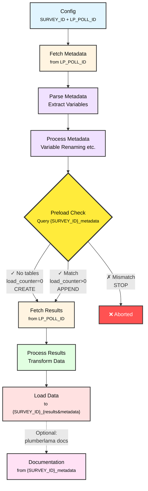

# plumberlama

It's lama with one l! Generate documentation for repeated cross-sectional surveys (anonymous participants) created with LamaPoll and process results to simplify self-service data analysis and visualization.

## Quick Start

### Option 1: Install as Package

Install plumberlama as a Python package (requires Python 3.12+):

```bash
# From GitHub
uv pip install "git+https://github.com/username/plumberlama.git"

# Or install a specific version/branch/tag
uv pip install "git+https://github.com/username/plumberlama.git@v0.1.0"

# Create .env file with configuration (see Configuration section below)

# Run the pipeline
plumberlama etl

# Or generate documentation only
plumberlama docs
```

### Option 2: Use containerized pipeline

See the example docker compose for how this could work:

```bash
# 1. Create .env file from template
cp .env.example .env
# Edit .env with your LamaPoll credentials and configuration

# 2. Start all services (PostgreSQL + Pipeline + Web server)
docker-compose up
```

This will:
- Start a PostgreSQL database
- Run the ETL pipeline to fetch and process survey data
- Generate documentation as a static MkDocs site
- Serve the documentation at http://localhost:8080

The pipeline runs ETL first, then generates documentation. Once complete, you can view the documentation in your browser at http://localhost:8080.

### Configuration

Create a `.env` file with your configuration:

```bash
# Survey Configuration
SURVEY_ID=my_survey                    # Stable identifier across poll iterations
LP_POLL_ID=1850964                     # LamaPoll poll ID
LP_API_TOKEN=your_token_here           # LamaPoll API token
LP_API_BASE_URL=https://app.lamapoll.de/api/v2

# LLM Configuration (for variable naming)
LLM_MODEL=openrouter/anthropic/claude-3.5-sonnet
OR_KEY=your_openrouter_key
LLM_BASE_URL=https://openrouter.ai/api/v1

# Documentation
DOC_OUTPUT_DIR=/tmp/docs
MKDOCS_SITE_NAME=My Survey Documentation
MKDOCS_SITE_AUTHOR=Survey Team
MKDOCS_REPO_URL=https://github.com/org/repo
MKDOCS_LOGO_URL=https://example.com/logo.svg

# Database Configuration
# For Docker: use 'postgres' as host
# For package install: use 'localhost' or leave empty for DuckDB
DB_HOST=postgres
DB_PORT=5432
DB_NAME=survey_data
DB_USER=plumberlama
DB_PASSWORD=plumberlama_dev
```

## Development

For contributing or local development:

```bash
# Clone the repository
git clone <repo-url>
cd plumberlama

# Install dependencies and set up environment
uv sync

# Set up pre-commit hooks
uv run pre-commit install

# Start PostgreSQL (optional, can use DuckDB locally)
docker-compose up -d postgres

# Run the pipeline
uv run plumberlama etl

# Run tests
uv run pytest
```

### Developing with Docker

**Important:** The Dockerfile installs plumberlama from GitHub (line 27), not from local source. This means local code changes won't be reflected in the Docker image until pushed to GitHub.

**Development workflow:**

1. Make your code changes locally
2. Test changes
3. Commit and push to GitHub
4. Rebuild the Docker image:
   ```bash
   docker compose -f docker-compose.example.yml build --no-cache pipeline
   docker compose -f docker-compose.example.yml up -d
   ```

**Alternative: Local development mode**

To test Docker changes with local code before pushing, modify the Dockerfile:

```dockerfile
# Replace lines 23-27 with:
COPY . /app
RUN --mount=type=cache,target=/root/.cache/uv \
    uv pip install --system .
```

Remember to revert this before committing, as the production Dockerfile should install from GitHub.

## Project Structure

```
plumberlama/
├── src/plumberlama/
│   ├── cli.py                  # Command-line interface
│   ├── config.py               # Configuration dataclass
│   ├── states.py               # Immutable state objects
│   ├── transitions.py          # State transition functions
│   ├── validation_schemas.py   # Pandera validation schemas
│   ├── api_models.py           # Pydantic API models (auto-generated)
│   ├── parse_metadata.py       # Question parsing and type inference
│   ├── documentation.py        # MkDocs generation
│   ├── type_mapping.py         # Polars ↔ String type conversion
│   ├── transform/
│   │   ├── cast_types.py       # Type casting
│   │   ├── decode.py           # Choice decoding
│   │   ├── llm.py              # LLM integration
│   │   ├── rename_results_columns.py
│   │   └── variable_naming.py  # Semantic naming
│   └── io/
│       ├── api.py              # API client
│       └── database.py         # Database operations
├── tests/
│   ├── unit/               # Unit tests
│   ├── integration/        # Integration tests
│   └── e2e/                # End-to-end tests
└── docs/                   # Generated documentation
```

## How It Works

The pipeline is built using **explicit state transitions** following functional programming principles. Each transition is a pure function that takes the current state and returns a new state.

### Pipeline Architecture



### Survey Identity & Cross-Sectional Data

- **`SURVEY_ID`**: Stable identifier for your cross-sectional survey. Names database tables (`{survey_id}_metadata`, `{survey_id}_results`)
- **`LP_POLL_ID`**: LamaPoll poll ID, can change between waves. Data from different polls with identical structure is appended to the same `SURVEY_ID` tables
- **`load_counter`**: Tracks which wave data came from (0=first load/CREATE, >0=subsequent loads/APPEND)

**Example:** Three yearly waves with different `LP_POLL_ID`s but same `SURVEY_ID=yearly_feedback` → all stored in `yearly_feedback_*` tables with load_counter 0, 1, 2.

### Question Type Inference

LamaPoll's native question types are refined based on structure:

| LamaPoll Type | Groups | Variables | Inferred Type | Schema |
|---------------|--------|-----------|---------------|--------|
| INPUT | 1 | 1 | `input_single_<type>` | String/Int64 |
| INPUT | >1 | 1 per group (>1 total) | `input_multiple_<type>` | Multiple String/Int64 |
| CHOICE | 1 | 1 | `single_choice` | String (Enum) |
| CHOICE | 1 | >1 | `multiple_choice` | Multiple Boolean |
| CHOICE | 2 | >1 | `multiple_choice_other` | Boolean + String |
| SCALE | 1 | 1 | `scale` | Int64 with range |
| MATRIX | 1 | >1 | `matrix` | Multiple Int64 with range |

See `src/plumberlama/parse_metadata.py` for full inference logic.

## Design Principles

**Functional Programming:**
- Pure functions with no side effects
- Immutable state objects (frozen dataclasses)
- Explicit data flow through state transitions
- Declarative style

**Contract Programming:**
- Preconditions) and postconditions enforced by state validation
- Type annotations guarantee correct data flow
- Pandera schemas enforce DataFrame structure invariants

**Data-Oriented Programming:**
- Separate data from code
- Generic data structures (DataFrames) over custom classes
- Immutable by default
- Schema separated from representation
