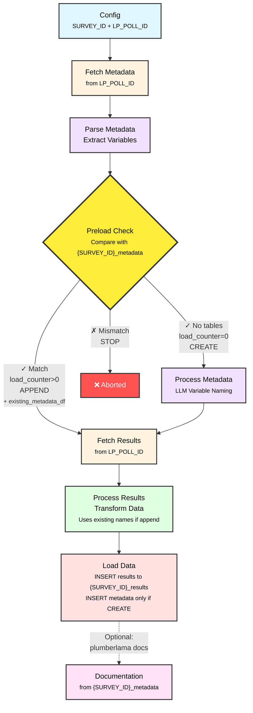

# plumberlama

It's lama with one l! Generate documentation for repeated cross-sectional surveys (anonymous participants) created with LamaPoll and process results to simplify self-service data analysis and visualization.

## Deployment

### Option 1: Install as Package

Install plumberlama as a Python package, for example in a uv project:

```bash
uv pip install "git+https://github.com/correlaid/plumberlama.git"

set -a && source .env && set +a

docker compose -f docker-compose.example.yml up -d postgres

uv run plumberlama etl

uv run plumberlama docs
```

You can then serve the generated site, for example with the following command (requires busybox utilities to be installed on your OS):

```bash
busybox httpd -f -vv -p 1102 -h /tmp/site  # Use the SITE_OUTPUT_DIR you configured

```


### Option 2: Use containerized pipeline

See the example docker compose and Dockerfile for how this could work. The Dockerfile contained in this repository installs the python code from the local source. See the comment in it for how to install from Github repository.

```bash
 docker compose -f docker-compose.example.yml up
```

This will:
- Start a PostgreSQL database
- Run the ETL pipeline to fetch and process survey data
- Generate documentation as a static MkDocs site
- Serve the documentation at http://localhost:8080

The pipeline runs ETL first, then generates documentation. Once complete, you can view the documentation in your browser at http://localhost:8080.

### Configuration

Create a `.env` file with your configuration:

```bash
# Survey Configuration
SURVEY_ID=my_survey                    # Stable identifier across poll iterations
LP_POLL_ID=1850964                     # LamaPoll poll ID
LP_API_TOKEN=your_token_here           # LamaPoll API token
LP_API_BASE_URL=https://app.lamapoll.de/api/v2

# LLM Configuration (for variable naming)
LLM_MODEL=openrouter/anthropic/claude-3.5-sonnet
OR_KEY=your_openrouter_key
LLM_BASE_URL=https://openrouter.ai/api/v1

# Documentation Configuration
SITE_OUTPUT_DIR=/tmp/site              # Directory for built HTML files
MKDOCS_SITE_NAME=My Survey Documentation
MKDOCS_SITE_AUTHOR=Survey Team
MKDOCS_REPO_URL=https://github.com/yourorg/yourrepo
MKDOCS_LOGO_URL=https://example.com/logo.svg

DB_HOST=postgres
DB_PORT=5432
DB_NAME=survey_data
DB_USER=plumberlama
DB_PASSWORD=plumberlama_dev
```

## Development

For contributing or local development:

```bash
# Clone the repository
git clone <repo-url>
cd plumberlama

# Install dependencies and set up environment
uv sync

# Set up pre-commit hooks
uv run pre-commit install

# Run e.g. unit tests after making changes
uv run pytest tests/unit/ -s -vv
```

## Project Structure

```
plumberlama/
├── src/plumberlama/
│   ├── cli.py                      # Command-line interface
│   ├── config.py                   # Configuration dataclass
│   ├── states.py                   # Immutable state objects
│   ├── transitions.py              # State transition functions
│   ├── validation_schemas.py       # Pandera validation schemas
│   ├── generated_api_models.py     # Pydantic API models (auto-generated)
│   ├── parse_metadata.py           # Question parsing and type inference
│   ├── documentation.py            # MkDocs generation
│   ├── type_mapping.py             # Polars ↔ String type conversion
│   ├── logging_config.py           # Logging configuration
│   ├── extract/
│   │   └── question_type.py        # Question type extraction and inference
│   ├── transform/
│   │   ├── cast_types.py           # Type casting
│   │   ├── decode.py               # Choice decoding
│   │   ├── llm.py                  # LLM integration
│   │   ├── rename_results_columns.py # Column renaming
│   │   └── variable_naming.py      # Semantic variable naming
│   └── io/
│       ├── api.py                  # LamaPoll API client
│       ├── database.py             # Database operations
│       └── database_queries.py     # SQL query templates
├── scripts/
│   ├── generate_api_models.py      # Generate Pydantic models from OpenAPI
│   └── query_db.py                 # Database query utility
├── tests/
│   ├── unit/                       # Unit tests
│   ├── integration/                # Integration tests
│   ├── e2e/                        # End-to-end tests
│   ├── conftest.py                 # Pytest configuration
│   └── docker-compose.test.yml     # Test database setup
├── docker-compose.example.yml      # Example deployment setup
├── Dockerfile                      # Container image definition
└── pyproject.toml                  # Project dependencies and metadata
```

## How It Works

The pipeline is built using **explicit state transitions** following functional programming principles. Each transition is a pure function that takes the current state and returns a new state.

### Pipeline Architecture


```mermaid
flowchart TD
    Config["Config<br/><small>SURVEY_ID + LP_POLL_ID</small>"]

    Config --> FetchMeta["Fetch Metadata<br/><small>from LP_POLL_ID</small>"]

    FetchMeta --> ParseMeta[Parse Metadata<br/>Extract Variables]

    ParseMeta --> PreloadCheck{"Preload Check<br/><small>Compare with {SURVEY_ID}_metadata</small>"}

    PreloadCheck -->|"✓ No tables<br/>load_counter=0<br/>CREATE"| ProcessMeta["Process Metadata<br/><small>LLM Variable Naming</small>"]
    PreloadCheck -->|"✓ Match<br/>load_counter>0<br/>APPEND<br/><small>+ existing_metadata_df</small>"| FetchResults["Fetch Results<br/><small>from LP_POLL_ID</small>"]
    PreloadCheck -->|"✗ Mismatch<br/>STOP"| Stop["❌ Aborted<br/>"]

    ProcessMeta --> FetchResults

    FetchResults --> ProcessResults["Process Results<br/>Transform Data<br/><small>Uses existing names if append</small>"]

    ProcessResults --> LoadData["Load Data<br/><small>INSERT results to {SURVEY_ID}_results<br/>INSERT metadata only if CREATE</small>"]

    LoadData -.->|Optional:<br/>plumberlama docs| Document["Documentation<br/><small>from {SURVEY_ID}_metadata</small>"]

    style Config fill:#e1f5ff,stroke:#333,stroke-width:2px,color:#000
    style FetchMeta fill:#fff4e1,stroke:#333,stroke-width:2px,color:#000
    style FetchResults fill:#fff4e1,stroke:#333,stroke-width:2px,color:#000
    style ParseMeta fill:#f0e1ff,stroke:#333,stroke-width:2px,color:#000
    style ProcessMeta fill:#f0e1ff,stroke:#333,stroke-width:2px,color:#000
    style PreloadCheck fill:#ffeb3b,stroke:#333,stroke-width:3px,color:#000
    style ProcessResults fill:#e1ffe1,stroke:#333,stroke-width:2px,color:#000
    style LoadData fill:#ffe1e1,stroke:#333,stroke-width:2px,color:#000
    style Document fill:#ffe1f5,stroke:#333,stroke-width:2px,color:#000
    style Stop fill:#ff5252,stroke:#333,stroke-width:2px,color:#fff
```

### Survey Identity & Cross-Sectional Data

- **`SURVEY_ID`**: Stable identifier for the cross-sectional survey. Names database tables (`{survey_id}_metadata`, `{survey_id}_results`)
- **`LP_POLL_ID`**: LamaPoll poll ID, can change between waves. Data from different polls with identical structure is appended to the same `SURVEY_ID` tables
- **`load_counter`**: Tracks which waves data came from (0=first load/CREATE, >0=subsequent loads/APPEND)

**Example:** Three yearly waves with different `LP_POLL_ID`s but same `SURVEY_ID=yearly_feedback` → all stored in `yearly_feedback_*` tables with load_counter 0, 1, 2.

### Pipeline Flow

**First Load (load_counter = 0):**
1. Fetch & parse metadata → Compare with database (no tables exist)
2. **Run LLM processing** to generate semantic variable names (Q1, Q2_age, etc.)
3. Fetch & process results using LLM-generated names
4. Create tables and insert both metadata and results

**Subsequent Loads (load_counter > 0):**
1. Fetch & parse metadata → Compare with database (validates survey structure unchanged)
2. **Skip LLM processing** - use existing variable names from database
3. Fetch & process results using existing names from first load
4. Insert only new results (metadata already exists)

This design ensures:
- **Performance**: LLM calls only happen on first load, not every time
- **Consistency**: Variable names never change after first load
- **Cost efficiency**: Saves on API calls for subsequent data appends

The preload check compares parsed metadata (original variable IDs like V1, V2) with the `original_id` column in the database to validate survey structure hasn’t changed, while allowing LLM-generated names to remain constant.

### Question Type Inference

LamaPoll’s native question types are refined based on structure:

| LamaPoll Type | Groups | Variables | Inferred Type | Schema |
|---------------|--------|-----------|---------------|--------|
| INPUT | 1 | 1 | `input_single_<type>` | String/Int64 |
| INPUT | >1 | 1 per group (>1 total) | `input_multiple_<type>` | Multiple String/Int64 |
| CHOICE | 1 | 1 | `single_choice` | String (Enum) |
| CHOICE | 1 | >1 | `multiple_choice` | Multiple Boolean |
| CHOICE | 2 | >1 | `multiple_choice_other` | Boolean + String |
| SCALE | 1 | 1 | `scale` | Int64 with range |
| MATRIX | 1 | >1 | `matrix` | Multiple Int64 with range |

See `src/plumberlama/parse_metadata.py` for full inference logic.

When a question config is wrong in Lamapoll, we log a warning and add this to the documentation. Currently, this is only done for the case that a multiple choice question has an other field, but no text value:
```
 ⚠  Warning: Question 27937506: Wie bist du zu [U25] gekommen?
   Variable V12 has ‘Sonstiges:’ but no text field.
   Suggestion: Configure as multiple_choice_other in LamaPoll
```

## Querying the Database

After running the ETL pipeline, you can query the PostgreSQL database using predefined query functions:

```bash
# List available query functions
uv run plumberlama query --list

# Use query functions (table_prefix automatically set from SURVEY_ID in .env)
uv run plumberlama query get_question_metadata  27937539
uv run plumberlama query get_frequency_distribution Q5
```

The command automatically loads database credentials and survey ID from your `.env` file. See `src/plumberlama/io/database_queries.py` for all available query functions.

# Misc

## Automated generation of pydantic types from Lamapoll API doc

- Run `uv run python scripts/generate_api_models.py`

## Manual Hosting on FTP Server

### 1. Start PostgreSQL

```bash
docker compose -f docker-compose.example.yml up -d postgres
```

### 2. Generate Documentation

```bash
uv run plumberlama docs
```

Expected output:
```
INFO     Generating documentation from database…
INFO     ✓ Logo downloaded to /tmp/plumberlama_docs_gr8gwvec/logo.svg
INFO     ✓ MkDocs site built successfully at /tmp/site
INFO        ✓ Generated documentation at /tmp/site
INFO     ============================================================
INFO     Documentation generated successfully!
```

### 3. Upload to FTP Server

```bash
lftp -c "
    set ftp:ssl-allow no;
    open -u deploy,<token> ftp://caiac-static-1.netbird.cloud:2121;
    mirror -R --verbose /tmp/site/ u25-docs/;
"
```

### 4. Access the Site

**URL:** https://u25-docs.correlaid.org

**Credentials:**
- Username: `admin`
- Password: (check Ansible secrets for `BASIC_AUTH_PASSWORD_STATIC`)

**Note:** Files are uploaded to `u25-docs/` (not `/var/www/sites/u25-docs/`) because the FTP server’s basePath is already `/var/www/sites`.
