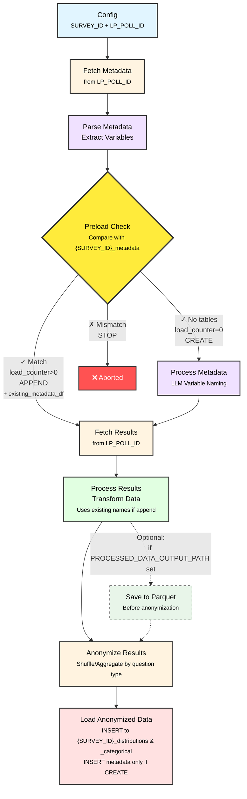

# plumberlama

It’s lama with one l! Process, anonymize and load survey results from LamaPoll to simplify self-service data analysis and visualization.

> **Note:** Documentation generation has been moved to a separate repository: [plumberlama-docs](https://github.com/CorrelAid/plumberlama-docs)

> **Note:** Explorative data analysis happens locally using the PROCESSED_DATA_OUTPUT_PATH environment variable. Make sure to not commit this file to the repo! *.parquet is added to the gitignore.

## Deployment

### Option 1: Install as Package

Install plumberlama as a Python package, for example in a uv project:

```bash
uv pip install "git+https://github.com/CorrelAid/plumberlama.git"

set -a && source .env && set +a

docker compose up -d postgres

uv run plumberlama etl
```

### Option 2: Use containerized pipeline

See the example docker compose and Dockerfile for how this could work. The Dockerfile contained in this repository installs the python code from the local source. See the comment in it for how to install from Github repository.

```bash
docker compose up -d
```

This will:
- Start a PostgreSQL database
- Run the ETL pipeline to fetch and process survey data

### Configuration

Create a `.env` file with your configuration:

```bash
# Survey Configuration
SURVEY_ID=my_survey                    # Stable identifier across poll iterations
LP_POLL_ID=123456                      # LamaPoll poll ID
LP_API_TOKEN=your_token_here           # LamaPoll API token
LP_API_BASE_URL=https://app.lamapoll.de/api/v2

# LLM Configuration (for variable naming)
LLM_MODEL=openrouter/anthropic/claude-3.5-sonnet
OR_KEY=your_openrouter_key
LLM_BASE_URL=https://openrouter.ai/api/v1

# Processed Data Output (optional - for saving before anonymization)
# PROCESSED_DATA_OUTPUT_PATH=/path/to/output/processed_data.parquet

# Database Configuration
DB_HOST=postgres
DB_PORT=5432
DB_NAME=survey_data
DB_USER=plumberlama
DB_PASSWORD=plumberlama_dev
```

## Development

For contributing or local development:

```bash
# Clone the repository
git clone https://github.com/CorrelAid/plumberlama.git
cd plumberlama

# Install dependencies and set up environment
uv sync

# Set up pre-commit hooks
uv run pre-commit install

# Run e.g. unit tests after making changes
uv run pytest tests/unit/ -s -vv
```

### Releases

Versions follow [Semantic Versioning](https://semver.org) and are managed by [release-please](https://github.com/googleapis/release-please) based on [Conventional Commits](https://www.conventionalcommits.org):

- `fix: ...` → patch release
- `feat: ...` → minor release
- `feat!: ...` or a `BREAKING CHANGE:` footer → major release (minor while below 1.0.0)
- `chore:`, `docs:`, `ci:`, `test:`, `refactor:` → no release

release-please keeps a Release PR open that bumps the version and updates `CHANGELOG.md`. Merging it tags the release, publishes the package to [PyPI](https://pypi.org/p/plumberlama) and pushes the versioned Docker image to `ghcr.io/correlaid/plumberlama`. Don't edit the version in `pyproject.toml` by hand.

## Project Structure

```
plumberlama/
├── src/plumberlama/
│   ├── cli.py                      # Command-line interface
│   ├── config.py                   # Configuration dataclass
│   ├── states.py                   # Immutable state objects
│   ├── transitions.py              # State transition functions
│   ├── validation_schemas.py       # Pandera validation schemas
│   ├── generated_api_models.py     # Pydantic API models (auto-generated)
│   ├── parse_metadata.py           # Question parsing and type inference
│   ├── type_mapping.py             # Polars ↔ String type conversion
│   ├── logging_config.py           # Logging configuration
│   ├── extract/
│   │   └── question_type.py        # Question type extraction and inference
│   ├── transform/
│   │   ├── anonymization.py        # Privacy-preserving data anonymization
│   │   ├── cast_types.py           # Type casting
│   │   ├── decode.py               # Choice decoding
│   │   ├── llm.py                  # LLM integration
│   │   ├── rename_results_columns.py # Column renaming
│   │   └── variable_naming.py      # Semantic variable naming
│   └── io/
│       ├── api.py                  # LamaPoll API client
│       ├── database.py             # Database operations
│       └── database_queries.py     # SQL query templates
├── scripts/
│   ├── generate_api_models.py      # Generate Pydantic models from OpenAPI
│   └── query_db.py                 # Database query utility
├── tests/
│   ├── unit/                       # Unit tests
│   ├── integration/                # Integration tests
│   ├── e2e/                        # End-to-end tests
│   ├── conftest.py                 # Pytest configuration
│   └── docker-compose.test.yml     # Test database setup
├── docker-compose.example.yml      # Example deployment setup
├── Dockerfile                      # Container image definition
└── pyproject.toml                  # Project dependencies and metadata
```

## How It Works

The pipeline is built using **explicit state transitions** following functional programming principles. Each transition is a pure function that takes the current state and returns a new state.

### Pipeline Architecture


```mermaid
flowchart TD
    Config["Config<br/><small>SURVEY_ID + LP_POLL_ID</small>"]

    Config --> FetchMeta["Fetch Metadata<br/><small>from LP_POLL_ID</small>"]

    FetchMeta --> ParseMeta[Parse Metadata<br/>Extract Variables]

    ParseMeta --> PreloadCheck{"Preload Check<br/><small>Compare with {SURVEY_ID}_metadata</small>"}

    PreloadCheck -->|"✓ No tables<br/>load_counter=0<br/>CREATE"| ProcessMeta["Process Metadata<br/><small>LLM Variable Naming</small>"]
    PreloadCheck -->|"✓ Match<br/>load_counter>0<br/>APPEND<br/><small>+ existing_metadata_df</small>"| FetchResults["Fetch Results<br/><small>from LP_POLL_ID</small>"]
    PreloadCheck -->|"✗ Mismatch<br/>STOP"| Stop["❌ Aborted<br/>"]

    ProcessMeta --> FetchResults

    FetchResults --> ProcessResults["Process Results<br/>Transform Data<br/><small>Uses existing names if append</small>"]

    ProcessResults -.->|"Optional:<br/>if PROCESSED_DATA_OUTPUT_PATH set"| SaveParquet["Save to Parquet<br/><small>Before anonymization</small>"]

    ProcessResults --> Anonymize["Anonymize Results<br/><small>Shuffle/Aggregate by question type</small>"]
    SaveParquet -.-> Anonymize

    Anonymize --> LoadData["Load Anonymized Data<br/><small>INSERT to {SURVEY_ID}_distributions & _categorical<br/>INSERT metadata only if CREATE</small>"]

    style Config fill:#e1f5ff,stroke:#333,stroke-width:2px,color:#000
    style FetchMeta fill:#fff4e1,stroke:#333,stroke-width:2px,color:#000
    style FetchResults fill:#fff4e1,stroke:#333,stroke-width:2px,color:#000
    style ParseMeta fill:#f0e1ff,stroke:#333,stroke-width:2px,color:#000
    style ProcessMeta fill:#f0e1ff,stroke:#333,stroke-width:2px,color:#000
    style PreloadCheck fill:#ffeb3b,stroke:#333,stroke-width:3px,color:#000
    style ProcessResults fill:#e1ffe1,stroke:#333,stroke-width:2px,color:#000
    style SaveParquet fill:#e8f5e9,stroke:#333,stroke-width:1px,stroke-dasharray: 5 5,color:#000
    style Anonymize fill:#fff3e0,stroke:#333,stroke-width:2px,color:#000
    style LoadData fill:#ffe1e1,stroke:#333,stroke-width:2px,color:#000
    style Stop fill:#ff5252,stroke:#333,stroke-width:2px,color:#fff
```

### Survey Identity & Cross-Sectional Data

- **`SURVEY_ID`**: Stable identifier for the cross-sectional survey. Names database tables (`{survey_id}_metadata`, `{survey_id}_distributions`, `{survey_id}_categorical`)
- **`LP_POLL_ID`**: LamaPoll poll ID, can change between waves. Data from different polls with identical structure is appended to the same `SURVEY_ID` tables
- **`load_counter`**: Tracks which waves data came from (0=first load/CREATE, >0=subsequent loads/APPEND)

**Example:** Three yearly waves with different `LP_POLL_ID`s but same `SURVEY_ID=yearly_feedback` → all stored in `yearly_feedback_*` tables with load_counter 0, 1, 2.

### Pipeline Flow

**First Load (load_counter = 0):**
1. Fetch & parse metadata → Compare with database (no tables exist)
2. **Run LLM processing** to generate semantic variable names (Q1, Q2_age, etc.)
3. Fetch & process results using LLM-generated names
4. *Optional:* Save processed data to parquet (if `PROCESSED_DATA_OUTPUT_PATH` set)
5. **Anonymize results** - shuffle or aggregate based on question type
6. Create tables and insert metadata and anonymized data

**Subsequent Loads (load_counter > 0):**
1. Fetch & parse metadata → Compare with database (validates survey structure unchanged)
2. **Skip LLM processing** - use existing variable names from database
3. Fetch & process results using existing names from first load
4. *Optional:* Save processed data to parquet (if `PROCESSED_DATA_OUTPUT_PATH` set)
5. **Anonymize results** - shuffle or aggregate based on question type
6. Insert only new anonymized data (metadata already exists)


### Question Type Inference

LamaPoll’s native question types are refined based on structure:

| LamaPoll Type | Groups | Variables | Inferred Type | Schema |
|---------------|--------|-----------|---------------|--------|
| INPUT | 1 | 1 | `input_single_<type>` | String/Int64 |
| INPUT | >1 | 1 per group (>1 total) | `input_multiple_<type>` | Multiple String/Int64 |
| CHOICE | 1 | 1 | `single_choice` | String (Enum) |
| CHOICE | 1 | >1 | `multiple_choice` | Multiple Boolean |
| CHOICE | 2 | >1 | `multiple_choice_other` | Boolean + String |
| SCALE | 1 | 1 | `scale` | Int64 with range |
| MATRIX | 1 | >1 | `matrix` | Multiple Int64 with range |

See `src/plumberlama/extract/question_type.py` for full inference logic.

When a question config is wrong in Lamapoll, we log a warning and add this to the documentation. Currently, this is only done for the case that a multiple choice question has an other field, but no text value:
```
 ⚠  Warning: Question 10000006: Wie hast du von uns erfahren?
   Variable V12 has 'Sonstiges:' but no text field.
   Suggestion: Configure as multiple_choice_other in LamaPoll
```

### Anonymization Strategy

Based on question type, different anonymization methods preserve statistical utility while protecting privacy:

| Question Type | Anonymization Method | Database Table | Reason |
|---------------|---------------------|----------------|--------|
| `single_choice` | **Aggregate** | `_categorical` | Counts preserve distribution, no individual choices |
| `multiple_choice` | **Aggregate** | `_categorical` | Per-option counts, no response patterns |
| `scale` | **Shuffle** | `_distributions` | Breaks linkage while preserving mean/variance |
| `matrix` | **Shuffle** | `_distributions` | Per-item shuffling prevents row reconstruction |
| `input_*_integer` | **Shuffle** | `_distributions` | Preserves statistics without respondent IDs |
| `input_*_singleline` | **Exclude** | _(not stored)_ | Free text could identify individuals |
| `input_*_multiline` | **Exclude** | _(not stored)_ | Free text could identify individuals |

**Database Schema:**

See `DistributionsSchema` and `CategoricalSchema` in `src/plumberlama/validation_schemas.py`

- `{survey_id}_distributions`: Shuffled individual values for numeric questions (variable_id, value, load_counter)
- `{survey_id}_categorical`: Aggregated counts for choice questions (variable_id, value, count, load_counter)
- `{survey_id}_metadata`: Variable descriptions and question metadata
  - Includes `anonymized_table` column indicating which table contains the data: `"_distributions"`, `"_categorical"`, or `null` (for excluded data)

## Querying the Anonymized Database

After running the ETL pipeline, you can query the PostgreSQL database using predefined query functions that work with the anonymized schema:

```bash
# List available query functions
uv run plumberlama query --list

# Query examples (table_prefix automatically set from SURVEY_ID in .env)
uv run plumberlama query get_question_metadata 10000039        # By question ID
uv run plumberlama query get_frequency_distribution Q6         # Categorical: counts & %
uv run plumberlama query get_distribution_stats Q12            # Numeric: mean, median, std
uv run plumberlama query get_time_series_analysis Q12          # Trends across waves
uv run plumberlama query find_variable_by_question_type scale  # Find by type

```

The command automatically loads database credentials and survey ID from your `.env` file.

# Misc

## Automated generation of pydantic types from Lamapoll API doc

Run `uv run python scripts/generate_api_models.py`


##
